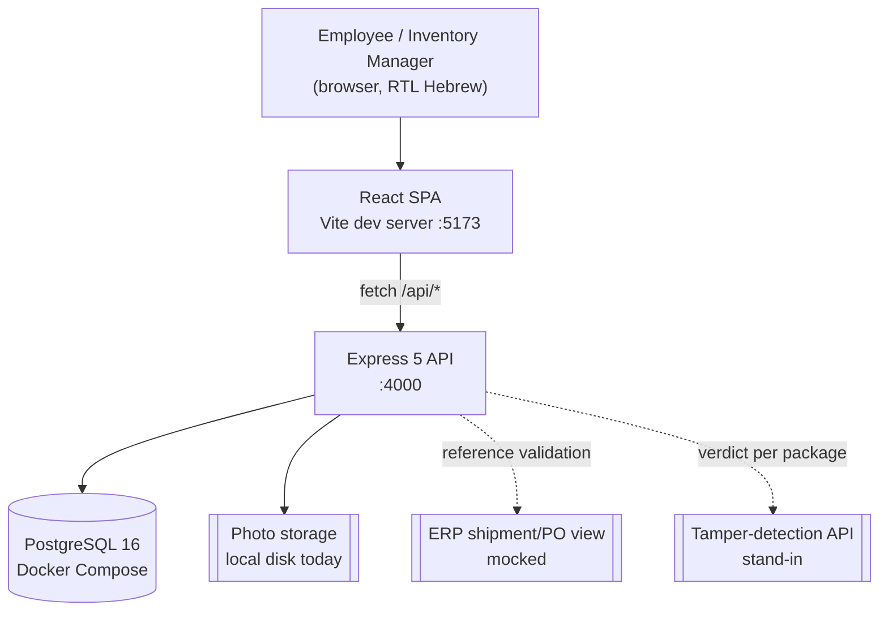
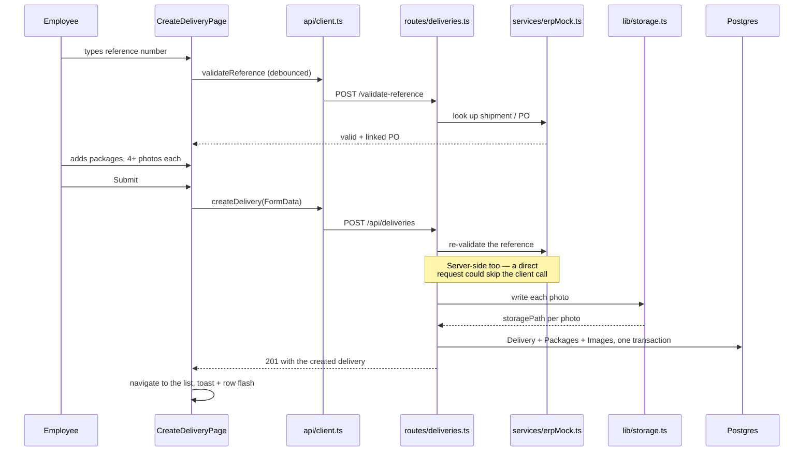
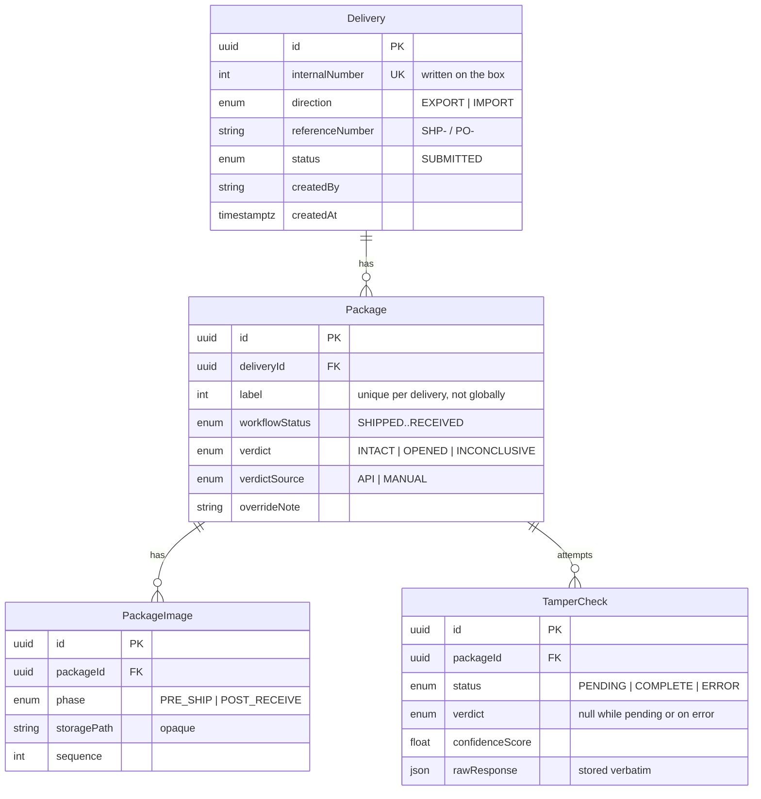

# Architecture

How the running system is put together. **DESIGN.md is the source of truth for
*what* the product does and why**; this file covers *where the code lives* and
*how a request moves through it*. When the two disagree, DESIGN.md wins and
this file is the one that is out of date.

## System context



Dashed edges are the two third-party systems this project does not own. Both
are stand-ins today (DESIGN.md §5, §9) and both sit behind a seam so the real
one swaps in at a single file.

## Repository layout

```
backend/
  prisma/schema.prisma     Data model and migrations
  src/app.ts               Express app: CORS, JSON, router mounts
  src/index.ts             Process entry — listens, reads env
  src/routes/              HTTP layer: parse, validate, respond
  src/services/            Business logic, no Express types
  src/middleware/          Cross-cutting Express: request id, errors, limits
  src/lib/                 Seams, config, logging, shared helpers
frontend/
  src/App.tsx              Routes
  src/api/client.ts        The only module that knows the API's shape
  src/pages/               One per route
  src/components/          Reused across pages
  src/lib/                 Display formatting, hooks, label rules
docs/                      This folder
ui/index.html              Standalone mockup — not the production frontend
```

The `routes → services → lib` split is the one structural rule on the backend:
routes own HTTP, services own decisions, lib owns the seams. A service never
imports `express`, which is what makes it directly unit-testable.

`middleware/` is the fourth directory and holds what is none of those three:
behavior that applies across requests rather than to one endpoint — the request
id, the error handler, the 404, the rate limiters. It exists so `app.ts` stays a
list of what is mounted in what order, which is the only place that order is
visible.

## API surface

| Method | Path | Purpose |
|---|---|---|
| `POST` | `/api/deliveries/validate-reference` | Check a shipment/PO number against the ERP mock |
| `POST` | `/api/deliveries` | Create a delivery with all its packages and pre-ship photos, in one request |
| `GET` | `/api/deliveries` | The list: derived status, search, filter, sort, paging |
| `GET` | `/api/deliveries/:id` | One delivery with packages and images |
| `POST` | `/api/packages/:id/post-receive-photos` | Upload receive photos, then run the check |
| `POST` | `/api/packages/:id/tamper-check` | Retry a check that failed |
| `POST` | `/api/packages/:id/review` | Manager's verdict override: a required note plus INTACT or OPENED |
| `GET` | `/api/packages` | The manager dashboard: every package flattened, priority-sorted, with operation-wide stats |
| `GET` | `/api/images/:id` | Serve one stored photo |
| `GET` | `/api/health` | Liveness: the process is up. Touches nothing else |
| `GET` | `/api/ready` | Readiness: the database answers and the process is not draining |

Everything is under `/api`, so the frontend's origin never encodes which
service answers (DESIGN.md §8).

## Request lifecycle: creating a delivery

The whole delivery is one request. Nothing is persisted before Submit
(DESIGN.md §3), so there is no draft to reconcile.



## Seams

Three things this project does not own, each isolated so the real
implementation replaces one file:

| Seam | File | Today | Production |
|---|---|---|---|
| ERP lookup | `services/erpMock.ts` | Deterministic fake | Oracle view (DESIGN.md §5) |
| Photo storage | `lib/storage.ts` | Local disk, opaque `storagePath` | Internal storage service (§7) |
| Tamper detection | `lib/tamperCheck.ts` | Stand-in behind `TamperCheckClient`, pinnable via `TAMPER_CHECK_OUTCOME` | Third-party API (§9) |

`storagePath` is deliberately opaque to the rest of the system: nothing but the
storage client interprets it, so swapping disk for a service changes no schema.

## Data model



Two model decisions worth knowing before changing anything here:

- **`TamperCheck` is one row per attempt**, not one per package. A retry after a
  failed call leaves an audit trail instead of overwriting one (DESIGN.md §3).
- **`Package.label` is unique per delivery only.** It is handwritten on a
  physical box, and numbers skip gaps rather than being reused — reuse would
  hand two boxes the same number after a delete.

## Derived status

`Delivery` has no stored column for "does this need attention". The list
computes `attentionStatus` in SQL from the delivery's packages, worst-first
(DESIGN.md §4.3). It is deliberately not called `status`: `Delivery.status`
persists `SUBMITTED` and means something else entirely.

Filtering, sorting and paging all run in Postgres, so a page is 20 rows however
large the history grows. See `services/deliveryQuery.ts`.

The dashboard (§4.4) derives a different thing from the same rows:
`services/packageQuery.ts` flattens every package across every delivery and
orders them by urgency rather than date — an unreviewed `OPENED` first, then a
failed call, then `INCONCLUSIVE`, with anything a human has already reviewed
sinking below packages still awaiting a verdict. "Needs review" is one SQL
fragment used twice, by the sort and by the flag each row carries, so the rule
cannot drift between them.

Its five stat cards are counted over every package, never over the returned
page: they are an overview of the operation, so narrowing them with the filters
below them would make them describe the page instead.

## Local development

```bash
docker compose up -d          # Postgres 16 on :5432
cd backend  && npm run dev    # API on :4000
cd frontend && npm run dev    # SPA on :5173
```

`backend/.env` needs `DATABASE_URL`; everything else has a development default.
`backend/.env.example` lists them all. `TAMPER_CHECK_OUTCOME` pins the
stand-in's verdict for a demo (`INTACT`, `OPENED`, `INCONCLUSIVE`,
`CALL_FAILED`, or `RANDOM`).

`src/lib/config.ts` is the only module that reads `process.env`. It validates at
import and reports every problem at once, so a misconfigured environment fails
at startup rather than at the first request that needed the missing piece. In
production it is stricter: `CORS_ORIGIN` becomes required, and `src/index.ts`
refuses to start at all if the tamper-detection client is still the mock or
`TAMPER_CHECK_OUTCOME` is set — a mocked verdict is indistinguishable from a
real one after the fact, since `verdictSource` says `API` either way.

Both packages run `npm test` and `npm run typecheck`. Run both — Vitest strips
types without checking them, so a green suite can sit on a broken build.
