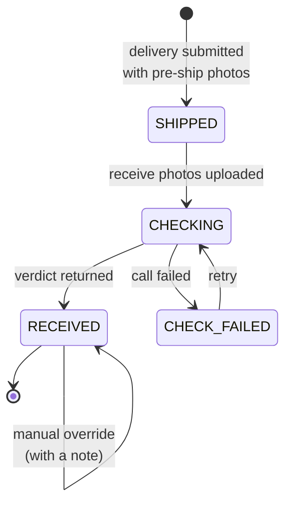
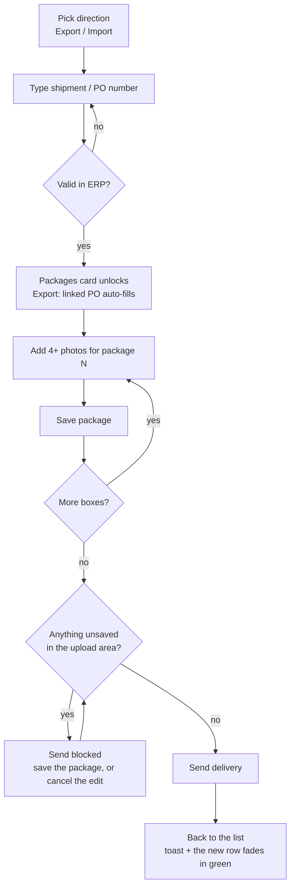
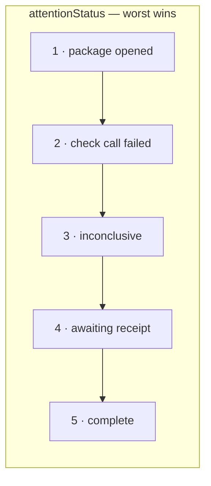

# User flows

What each screen is for and how a delivery moves through the system. The
reasoning behind these flows lives in DESIGN.md §4; this file is the map.

## Screens

| Route | Screen | DESIGN.md |
|---|---|---|
| `/deliveries` | My Deliveries — the landing page | §4.3 |
| `/deliveries/new` | Create Delivery | §4.1 |
| `/deliveries/:id` | Delivery packages — receive photos, verdicts | §4.2 |
| *not built* | Inventory Manager dashboard (לוח בקרה) | §4.4 |

## A package's life



A verdict is `INTACT`, `OPENED` or `INCONCLUSIVE`. `CHECK_FAILED` is not a
verdict — the call itself did not complete, so there is nothing to report and
the only way forward is a retry.

## Shipping (§4.1)

One continuous page, not a wizard. The packages card is present from the start
but disabled until the reference validates — a card unlocking in place, not a
navigation.



Two guards worth knowing:

- **The reference is validated again on the server** when the delivery is
  created. The create endpoint originally trusted that the client had called
  validate-reference first, which a direct request could simply skip.
- **Send waits on unsaved work.** Photos picked but never saved belong to no
  package, so submitting would drop them silently. The block distinguishes a
  package never saved from one reopened for editing — different mistakes,
  different instructions.

## Receiving (§4.2)

```mermaid
sequenceDiagram
  participant U as Employee
  participant P as DeliveryPackagesPage
  participant A as API
  participant T as Tamper-check stand-in

  U->>P: opens a delivery, picks a SHIPPED package
  U->>P: uploads 4+ receive photos
  P->>A: POST /packages/:id/post-receive-photos
  A->>T: compare pre-ship vs post-receive
  Note over P,A: package is CHECKING;<br/>the page polls only while<br/>something is in flight
  T-->>A: verdict, or a failure
  A-->>P: next poll carries the result
  P->>P: the resolved package opens on its photos
```

The page opens the resolved package on its evidence, so the verdict and the
photos behind it land together. It never steals an upload panel that has
photos picked in it — a background event must not bin work in progress.

## My Deliveries (§4.3)

Every delivery the employee submitted, newest first, answering one question:
*do I need to act on this?*



Priorities 1 and 2 outrank 3 even mid-transit: an opened package does not wait
for the rest of the delivery to matter.

Search, status filter, sort and paging all run in Postgres and live in the URL,
so a filtered view survives a refresh and the back button steps through it.
